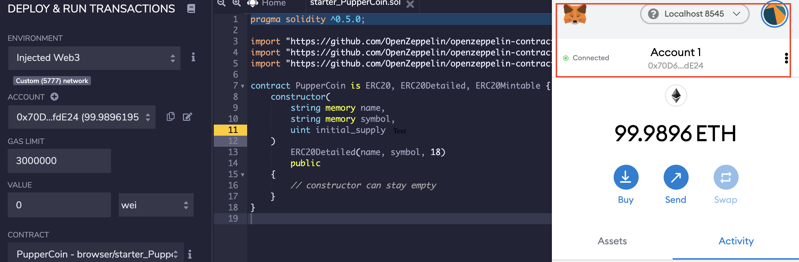

# Advanced Solidity - PupperCoin

*This repository contains the Unit 21 Advanced Solidity homework assignment; You Sure can Attract a Crowd in the FinTech bootcamp course at the University of Toronto's School of Continuing Studies.* 

---

## Table of Contents

- [Installation Requirements](#Installation-Requirements)
- [Project Objective](#Project-Objective)
- [PupperCoin Demo](#PupperCoin-Demo)
- [File Contents](#File-Contents)

---

## Installation Requirements

This project uses the MetaMask extension and Ganache application. For installation instructions, please refer to the [Installation Guide](Installation_Guide.md). Additionally, the [Remix Platform](https://www.remix.ethereum.org) is used. 

---

## Project Objective 

This project seeks to creare an ERC20 token minted through the `Crowdsale` contract leverged from the `OpenZeppelin Solidity library.` This contract will allow users to send ETH and receive PupperCoin (PUP). Additionally, the contract will automatically mint and distribute the tokens to the buyers in a single transaction. 

The project inherits; 

   - `Crowdsale`
   - `CappedCrowdsale`
   - `TimedCrowdsale`
   - `RefundableCrowdsale`
   - `MintedCrowdsale`

To emulate a real-world pre-production test, the project will be deployed in the Kovan or Ropsten testnet. **However, due to technical issues, this project is deployed through the `local host testnet network.`** 

---