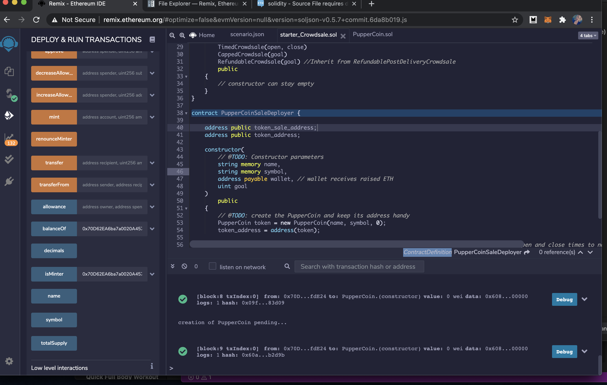

# Advanced Solidity - PupperCoin

*This repository contains the Unit 21 Advanced Solidity homework assignment; You Sure can Attract a Crowd in the FinTech bootcamp course at the University of Toronto's School of Continuing Studies.* 

---

## Table of Contents

- [Installation Requirements](#Installation-Requirements)
- [Project Objective](#Project-Objective)
- [PupperCoin Demo](#PupperCoin-Demo)
- [File Contents](#File-Contents)

---

## Installation Requirements

This project uses the MetaMask extension and Ganache application. For installation instructions, please refer to the [Installation Guide](Installation_Guide.md). Additionally, the [Remix Platform](https://www.remix.ethereum.org) is used. 

---

## Project Objective 

This project seeks to creare an ERC20 token minted through the `Crowdsale` contract leverged from the `OpenZeppelin Solidity library.` This contract will allow users to send ETH and receive PupperCoin (PUP). Additionally, the contract will automatically mint and distribute the tokens to the buyers in a single transaction. 

The project inherits; 

   - `Crowdsale`
   - `CappedCrowdsale`
   - `TimedCrowdsale`
   - `RefundableCrowdsale`
   - `MintedCrowdsale`

To emulate a real-world pre-production test, the project will be deployed in the Kovan or Ropsten testnet. **However, due to technical issues, this project is deployed through the `local host testnet network.`** 

---

## PupperCoin Demo 

**Please Note:** The following PupperCoin demo is based in the LocalHost 8545 testnet 

### Deploying ERC20 PupperCoin

The ERC20 functions in the PupperCoin contract creates a deployer allowing users to select the name and symbol of a new token and set the initial supply. 

### Deploying the CrowdSale Contract 

The second contract uses the following functions; 

- Crowdsale
- MintedCrowdsale
- CappedCrowdsale
- TimedCrowdsale
- RefundablePostDeliveryCrowdsale

This allows users to populate the construction parameters. The prefilled attributes in the contract allows the users to supply the token and sale addresses. 

### MetaMask & Ganache 

Both contracts are deployed on the LocalHost 8545 network through the MetaMask extension. 

The image below confrims the contract deployed successfully and the transaction has been recorded in MetaMask and Ganache. 

### Purchasing PupperCoin 

Following the above steps; creating the [PupperCoin](PupperCoin.sol) and [CrowdSale](Crowdsale.sol) contracts, input the correct constructor paramters, token and sale addresses whilst connecting the a testnet will allow users to purchase PupperCoin tokens. 

---

## File Contents 

- [Unit 21 Instructions](Unit21_Instructions.md)
- [PupperCoin Contract](PupperCoin.sol)
- [CrowdSale Contract](Crowdsale.sol)

---
